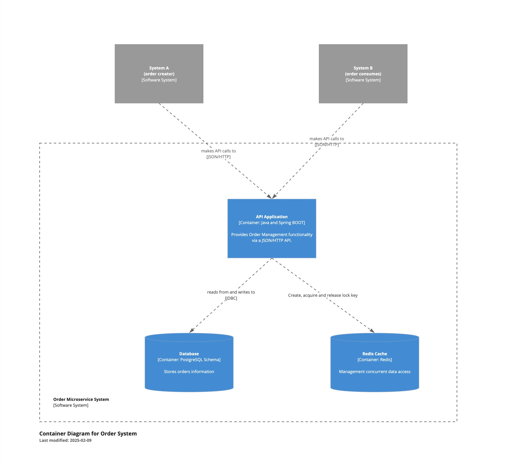
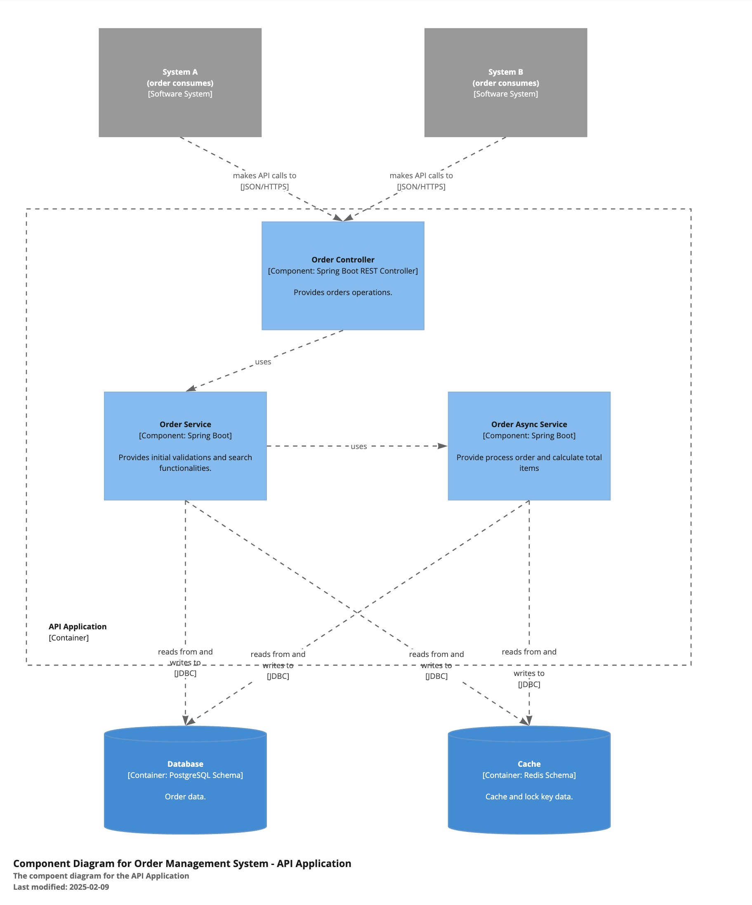
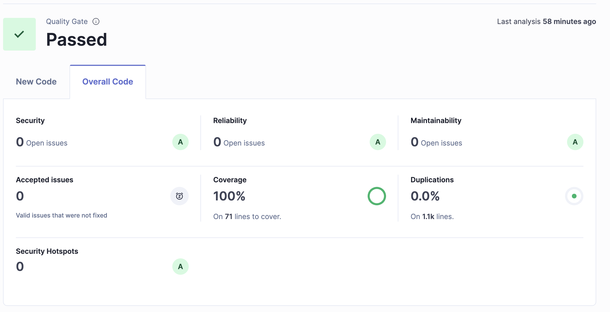

# Order Service

The Order Service is a microservice built using Spring Boot, Maven, PostqreSQL and Redis. It provides APIs for order management to meet the challenge proposed for Java Developer hiring process. The API is documented using OpenAPI.

---

## **Technologies Used**

- **Java**: Programming language.
- **Spring Boot**: Framework for building the microservice.
- **Maven**: Dependency management and build tool.
- **PostgreSQL**: Database for development.
- **OpenAPI**: API documentation and testing interface.
- **Redis**: Cache management to control simultaneous access to the data.

---

## **C4 Architecture Model**

### **Container**




### **Component**



---

## **Quality Gate**



---

## **Getting Started**

### **Prerequisites**

Ensure you have the following installed:

- **Java 21 or higher**
- **[Docker](https://www.docker.com/products/docker-desktop/)**
- **Docker Compose**


### **Cloning the Repository**

```bash
# Clone the repository
git clone https://github.com/your-repo/wallet-service.git
cd ms_order
```

---

### **Build and Run the Application**

1. **Download docker images:**
   ```
   ./docker-compose.sh
   ```

2. **Build docker:**
   ```bash
   docker build . -t ambev/ms_order
   ```

3. **Run docker:**
   ```bash
	docker run -p 8080:8080 --rm ambev/ms_order
   ```

The application will start at `http://localhost:8080`.

---

### **API Documentation**

The API is documented using OpenAPI and can be accessed via the Swagger UI:

- Open your browser and navigate to:  [http://localhost:8080/v1/api/swagger-ui/index.html](http://localhost:8080/v1/api/swagger-ui/index.html)

Here, you can view and test all the available endpoints.

---

## **Contact**

For any inquiries or issues, contact the maintainer:
- **Name**: Maurício Rodrigues
- **Email**: [jmauriciojr@gmail.com](mailto:jmauriciojr@gmail.com)

